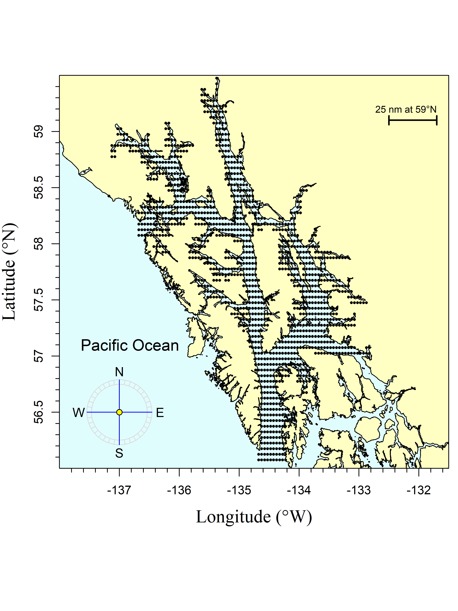
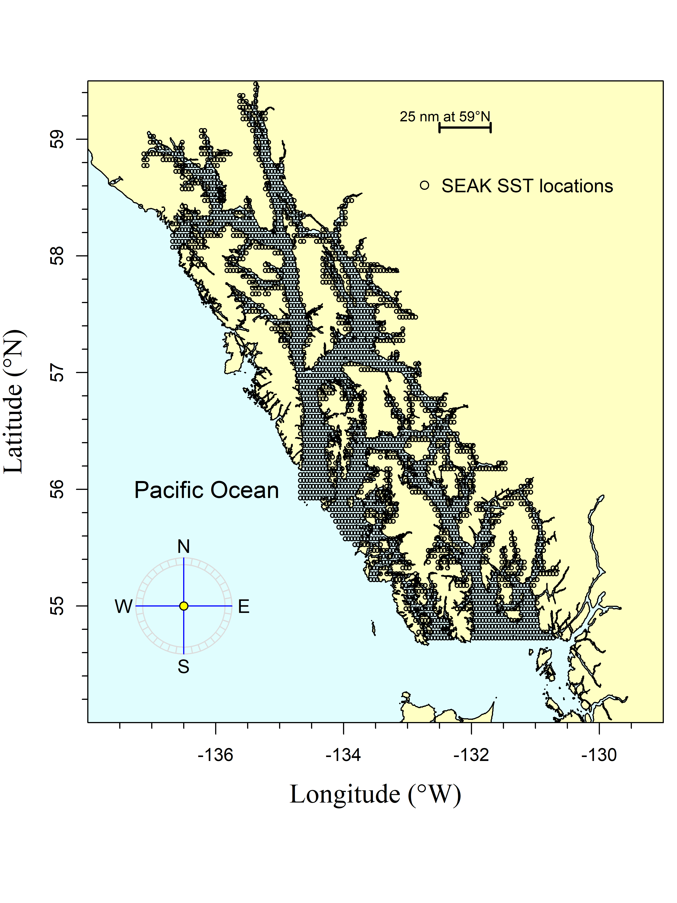
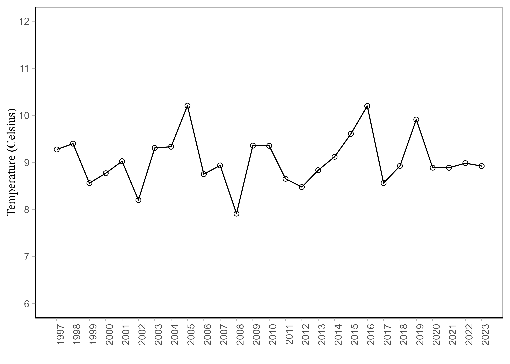

# Objective
The overall objective is to test a variety of temperature variables, using satellite sea surface temperature (SST) data or Southeast Alaska Coastal Monitoring project (SECM) data, within the forecasting model framework to forecast the 2024 pink salmon harvest in southeast Alaska (SEAK). This write-up is a summary of available SST variables based on satellite data (i.e., average of May (May), the average over the months of May through July (MJJ), the average over the months of April through June (AMJ), or the average over the months of April through July (AMJJ) from 1997 through 2024) over four regions of SEAK; Icy Strait, Icy and Chatham Straits, northern southeast Alaska (NSEAK), and SEAK. This write-up also includes a summary of SECM survey data from various months (i.e., the average over the months of May, June, and July (MJJ)) at 20 m depths of the SECM transects (i.e., Icy Strait and Upper Chatham transects stations ISA, ISB, ISC, ISD, UCA, UCB, UCC, UCD) from 1997 through 2024. 

# Methods
## Satellite-derived SST data
Satellite-derived sea surface temperature (SST) data from April 1997 through July 2024 were pulled from the 'SST and SST Anomaly, NOAA Global Coral Bleaching Monitoring, 5km, V.3.1, Monthly, 1985-Present' time series (https://coastwatch.pfeg.noaa.gov/erddap/griddap/NOAA_DHW_monthly.html; full citation in references). This satellite-derived SST data set was then matched to pre-determined coordinates from four spatial regions that corresponded with sixteen variables of interest (four regions; four temporal variables per region). 

### Satellite-derived SST variables
**Icy_Strait_SST_May**: The Icy Strait region encompasses waters of Icy Strait from the east end of Lemesurier Island to a line from Point Couverden south to Point Augusta. This variable is the average SST in May (Table 1; Figure 1; Figure 5a).

**Icy_Strait_SST_MJJ**: The Icy Strait region encompasses waters of Icy Strait from the east end of Lemesurier Island to a line from Point Couverden south to Point Augusta. This variable is the average SST in May through July (Table 1; Figure 1; Figure 5b).

**Icy_Strait_SST_AMJ**: The Icy Strait region encompasses waters of Icy Strait from the east end of Lemesurier Island to a line from Point Couverden south to Point Augusta. This variable is the average SST in April through June (Table 1; Figure 1; Figure 5c).

**Icy_Strait_SST_AMJJ**: The Icy Strait region encompasses waters of Icy Strait from the east end of Lemesurier Island to a line from Point Couverden south to Point Augusta. This variable is the average SST in April through July (Table 1; Figure 1; Figure 5d).

**Chatham_SST_May**: The Chatham and Icy Straits region encompasses waters of Chatham and Icy Straits east of Lemesurier Island to Point Couverden, and south to the approximate latitude of 56.025 degrees north (roughly Cape Decision off Kuiu Island) (Figure 2 and Figure 5a; Table 2). This variable is the average SST in May.

**Chatham_SST_MJJ**: The Chatham and Icy Straits region encompasses waters of Chatham and Icy Straits east of Lemesurier Island to Point Couverden, south to the approximate latitude of 56.025 degrees north (roughly Cape Decision off Kuiu Island) (Figure 2 and Figure 5b; Table 2). This variable is the average SST in May through July. 

**Chatham_SST_AMJ**: The Chatham and Icy Straits region encompasses waters of Chatham and Icy Straits east of Lemesurier Island to Point Couverden, south to the approximate latitude of 56.025 degrees north (roughly Cape Decision off Kuiu Island) (Figure 2 and Figure 5c; Table 2). This variable is the average SST in April through June.

**Chatham_SST_AMJJ**: The Chatham and Icy Straits region encompasses waters of Chatham and Icy Straits east of Lemesurier Island to Point Couverden, south to the approximate latitude of 56.025 degrees north (roughly Cape Decision off Kuiu Island) (Figure 2 and Figure 5d; Table 2). This variable is the average SST in April through July.

**NSEAK_SST_May**: The NSEAK region encompasses northern Southeast Alaska from 59.475 to 56.075 degrees north latitude (approximately Districts 9 through 15, and District 13 inside area only; northern Southeast Inside subregion for Southeast Alaska (NSEI); Figure 3 and Figure 5a; Table 3). This variable is the average SST in May. 

**NSEAK_SST_MJJ**: The NSEAK region encompasses northern Southeast Alaska from 59.475 to 56.075 degrees north latitude (approximately Districts 9 through 15, and District 13 inside area only; northern Southeast Inside subregion for Southeast Alaska (NSEI); Figure 3 and Figure 5b; Table 3). This variable is the average SST in May through July.

**NSEAK_SST_AMJ**: The NSEAK region encompasses northern Southeast Alaska from 59.475 to 56.075 degrees north latitude (approximately Districts 9 through 15, and District 13 inside area only; northern Southeast Inside subregion for Southeast Alaska (NSEI); Figure 3 and Figure 5c; Table 3). This variable is the average SST in April through June.

**NSEAK_SST_AMJJ**: The NSEAK region encompasses northern Southeast Alaska from 59.475 to 56.075 degrees north latitude (approximately Districts 9 through 15, and District 13 inside area only; northern Southeast Inside subregion for Southeast Alaska (NSEI); Figure 3 and Figure 5d; Table 3). This variable is the average SST in April through July.

**SEAK_SST_May**: The SEAK region encompasses Southeast Alaska from 59.475 to 54.725 degrees north latitude (Figure 4 and Figure 5a; Table 4). This variable is the average SST in May.

**SEAK_SST_MJJ**: The SEAK region encompasses northern Southeast Alaska from 59.475 to 54.725 degrees north latitude (Figure 4 and Figure 5b; Table 4). This variable is the average SST in May through July.

**SEAK_SST_AMJ**: The SEAK region encompasses Southeast Alaska from 59.475 to 54.725 degrees north latitude (Figure 4 and Figure 5c; Table 4). This variable is the average SST in April through June.

**SEAK_SST_AMJJ**: The SEAK region encompasses Southeast Alaska from 59.475 to 54.725 degrees north latitude (Figure 4 and Figure 5d; Table 4). This variable is the average SST in April through July.

## SECM survey temperature data
SECM survey temperature data were summarized by year (1997 to 2024), month (average over the months of May, June, and July) at 20m depths for the Icy Strait and Upper Chatham transects combined.

### SECM survey temperature variables

**ISTI20_MJJ**: Average temperature in the upper 20m during May through July at 8 stations in Icy Strait (Icy Strait and Upper Chatham transects; Figure 1; Figure 6; Table 5).

# Results  

## Satellite-derived SST data
Satellite sea surface temperature data were summarized by region and year (i.e., average of May (May), the average over the months of May, June, and July (MJJ), the average over the months of April through June (AMJ), or the average over the months of April through July (AMJJ)) from 1997 to 2024 (Tables 1 through 4).

\pagebreak

Table: Satellite sea temperature data from the Icy Strait region from 1997 to 2024 for the month of May (May), May through July (MJJ), April through June (AMJ), and April through July (AMJJ). There are 70 satellite stations (latitude/longitude combinations) in the Icy Strait region.

 year    Icy_Strait_SST_MJJ    Icy_Strait_SST_May    Icy_Strait_SST_AMJJ    Icy_Strait_SST_AMJ 
------  --------------------  --------------------  ---------------------  --------------------
 1997          10.30                  7.01                  8.83                   7.30        
 1998           9.97                  7.34                  8.85                   7.56        
 1999           9.08                  6.17                  8.02                   6.78        
 2000           9.94                  7.02                  8.67                   7.35        
 2001           9.57                  6.48                  8.40                   7.08        
 2002           9.34                  6.26                  8.02                   6.60        
 2003          10.08                  7.29                  8.88                   7.53        
 2004          10.68                  7.53                  9.25                   7.69        
 2005          11.16                  8.40                  9.64                   8.26        
 2006          10.19                  6.84                  8.86                   7.49        
 2007           9.49                  6.55                  8.16                   6.87        
 2008           8.85                  6.43                  7.72                   6.68        
 2009           9.94                  7.19                  8.47                   7.22        
 2010           9.87                  7.71                  8.68                   7.81        
 2011           9.84                  6.81                  8.47                   7.18        
 2012           9.23                  6.92                  8.10                   7.07        
 2013           9.88                  6.37                  8.45                   6.97        
 2014          10.23                  7.90                  8.81                   7.62        
 2015          10.73                  8.34                  9.43                   8.29        
 2016          11.65                  8.81                  10.37                  9.14        
 2017           9.82                  7.22                  8.66                   7.51        
 2018           9.99                  6.92                  8.74                   7.43        
 2019          10.74                  7.79                  9.51                   8.10        
 2020          10.40                  7.83                  9.05                   7.86        
 2021          10.26                  6.91                  8.91                   7.47        
 2022          10.34                  7.13                  8.88                   7.40        
 2023           9.72                  7.13                  8.43                   7.10        

\pagebreak

Table: Satellite sea temperature data from the Chatham and Icy Straits region from 1997 to 2024 for the month of May (May), May through July (MJJ), April through June (AMJ), and April through July (AMJJ).  There are 313 satellite stations (latitude/longitude combinations) in the Chatham and Icy Straits region.

 year    Chatham_SST_MJJ    Chatham_SST_May    Chatham_SST_AMJJ    Chatham_SST_AMJ 
------  -----------------  -----------------  ------------------  -----------------
 1997         10.08              7.48                8.83               7.59       
 1998         9.85               7.83                8.91               7.88       
 1999         8.90               6.84                8.05               7.12       
 2000         9.70               7.34                8.62               7.52       
 2001         9.15               6.74                8.18               7.12       
 2002         8.97               6.39                7.85               6.64       
 2003         9.92               7.71                8.90               7.85       
 2004         10.43              7.94                9.22               7.96       
 2005         10.67              8.51                9.48               8.44       
 2006         9.78               7.16                8.68               7.58       
 2007         9.52               7.04                8.41               7.27       
 2008         8.65               6.77                7.69               6.83       
 2009         9.75               7.30                8.46               7.35       
 2010         9.65               7.97                8.66               7.93       
 2011         9.59               7.31                8.49               7.55       
 2012         9.17               7.07                8.18               7.22       
 2013         9.66               6.74                8.44               7.21       
 2014         9.98               8.17                8.76               7.77       
 2015         10.62              8.87                9.55               8.73       
 2016         11.04              8.92               10.03               9.07       
 2017         9.65               7.65                8.70               7.76       
 2018         9.87               7.40                8.75               7.61       
 2019         10.47              8.24                9.46               8.35       
 2020         9.99               8.09                8.84               7.86       
 2021         10.06              7.25                8.90               7.63       
 2022         10.17              7.52                8.92               7.64       
 2023         9.80               7.53                8.61               7.40       

\pagebreak

Table: Satellite sea temperature from the northern Southeast Alaska (NSEAK) region from 1997 to 2024 for the month of May (May), May through July (MJJ), April through June (AMJ), and April through July (AMJJ). There are 1,344 satellite stations (latitude/longitude combinations) in the NSEAK region.

 year    NSEAK_SST_MJJ    NSEAK_SST_May    NSEAK_SST_AMJJ    NSEAK_SST_AMJ 
------  ---------------  ---------------  ----------------  ---------------
 1997        10.02            7.35              8.71             7.40      
 1998        9.89             7.65              8.85             7.71      
 1999        8.93             6.70              7.98             6.95      
 2000        9.70             7.23              8.57             7.39      
 2001        9.22             6.66              8.17             7.01      
 2002        9.05             6.39              7.88             6.61      
 2003        9.86             7.57              8.76             7.60      
 2004        10.38            7.89              9.09             7.79      
 2005        10.63            8.42              9.35             8.26      
 2006        9.72             6.98              8.55             7.36      
 2007        9.44             6.90              8.24             7.03      
 2008        8.65             6.64              7.63             6.74      
 2009        9.77             7.32              8.40             7.24      
 2010        9.62             7.76              8.54             7.72      
 2011        9.67             7.25              8.44             7.44      
 2012        9.14             6.95              8.09             7.10      
 2013        9.67             6.59              8.36             7.04      
 2014        10.03            8.15              8.70             7.64      
 2015        10.81            8.92              9.56             8.65      
 2016        11.18            8.92             10.05             9.00      
 2017        9.82             7.75              8.77             7.78      
 2018        10.11            7.53              8.86             7.63      
 2019        10.87            8.42              9.65             8.44      
 2020        10.23            8.26              8.98             7.94      
 2021        10.23            7.29              8.96             7.65      
 2022        10.52            7.62              9.11             7.74      
 2023        9.98             7.53              8.69             7.41      

\pagebreak

Table: Satellite sea temperature from the Southeast Alaska (SEAK) region from 1997 to 2024 for the month of May (May), May through July (MJJ), April through June (AMJ), and April through July (AMJJ). There are 2,663 satellite stations (latitude/longitude combinations) in the SEAK region.

 year    SEAK_SST_MJJ    SEAK_SST_May    SEAK_SST_AMJJ    SEAK_SST_AMJ 
------  --------------  --------------  ---------------  --------------
 1997       10.47            8.00            9.20             7.99     
 1998       10.36            8.37            9.38             8.37     
 1999        9.30            7.23            8.40             7.43     
 2000       10.02            7.71            8.95             7.86     
 2001        9.51            7.10            8.52             7.45     
 2002        9.44            6.92            8.33             7.14     
 2003       10.32            8.17            9.25             8.16     
 2004       10.98            8.58            9.74             8.51     
 2005       11.06            8.92            9.83             8.82     
 2006       10.19            7.63            9.07             7.96     
 2007        9.99            7.51            8.82             7.64     
 2008        9.18            7.22            8.17             7.28     
 2009       10.20            7.76            8.85             7.73     
 2010       10.09            8.28            9.05             8.23     
 2011       10.05            7.74            8.88             7.92     
 2012        9.68            7.47            8.63             7.61     
 2013       10.39            7.51            9.10             7.85     
 2014       10.57            8.62            9.26             8.17     
 2015       11.43            9.64            10.21            9.32     
 2016       11.67            9.61            10.59            9.59     
 2017       10.31            8.25            9.28             8.29     
 2018       10.79            8.28            9.54             8.30     
 2019       11.46            9.01            10.25            9.05     
 2020       10.70            8.90            9.52             8.53     
 2021       10.82            7.97            9.58             8.31     
 2022       11.04            8.22            9.68             8.38     
 2023       10.68            8.21            9.35             8.04     

\pagebreak

## SECM survey temperature data
SECM survey temperature data were summarized by year (1997 to 2024), month (average over the months of May, June, and July) at 20m depths; Table 5).

Table: The SECM survey temperature data were summarized by year (1997 to 2024), month (the months of May, June, and July; MJJ) at 20m depths for the Icy Strait and Upper Chatham transects (stations ISA, ISB, ISC, ISD, UCA, UCB, UCC, UCD).

 

 

 

 

![A. The May temperature averaged over each region (Chatham and Icy Straits, Icy Strait, NSEAK, SEAK) from 1997 through 2024. B. The May, June, and July temperature averaged over each region (Chatham and Icy Straits, Icy Strait, NSEAK, SEAK) from 1997 through 2024. C. The April through June temperature averaged over each region (Chatham and Icy Straits, Icy Strait, NSEAK, SEAK) from 1997 through 2024. D. The April through July temperature averaged over each region (Chatham and Icy Straits, Icy Strait, NSEAK, SEAK) from 1997 through 2024.](../../2024_forecast/results/temperature_data/monthly_temp_regions.png) 

 

# Acknowledgements
Jordan Watson (NOAA) helped with the code to process the satellite data into a usable format. The data was accessed through NOAA's Coral Reef Watch (https://coastwatch.pfeg.noaa.gov/erddap/griddap/NOAA_DHW_monthly.html and https://coastwatch.pfeg.noaa.gov/erddap/griddap/NOAA_DHW.html). Emily Fergusson summarized the SECM survey data by year, month, and depth. All code and associated data are located here: https://github.com/commfish/southeast_pink_salmon_preseason in the 2024_forecast folder.

\pagebreak

# References
Huang, B., P. W. Thorne, V. F. Banzon,, T. Boyer, G. Chepurin, J. H. Lawrimore, M. J. Menne, T. M. Smith, R. S. Vose, and H. M. Zhang. 2017. Extended reconstructed sea surface temperature, version 5 (ERSSTv5): upgrades, validations, and intercomparisons. Journal of Climate 30:8179–8205.

NOAA Coral Reef Watch (NOAA_DHW_monthly dataset). 2022, updated daily. NOAA Coral Reef Watch Version 3.1 Monthly 5km SST and SST Anomaly, NOAA Global Coral Bleaching Monitoring Time Series Data, May 1997-June 2021. College Park, Maryland, USA: NOAA/NESDIS/STAR Coral Reef Watch program. Data set accessed 2022-09-12 at https://coastwatch.pfeg.noaa.gov/erddap/griddap/NOAA_DHW_monthly.html.

NOAA Coral Reef Watch (NOAA_DHW dataset). 2022, updated daily. NOAA Coral Reef Watch Daily Near-real-Time Global 5km SST and SST Anomaly, NOAA Global Coral Bleaching Monitoring Time Series Data, July 2021 to July 2022. College Park, Maryland, USA: NOAA/NESDIS/STAR Coral Reef Watch program. Data set accessed 2022-09-12 at https://coastwatch.pfeg.noaa.gov/erddap/griddap/NOAA_DHW.html.

Piston, A. W., J. Murphy, J. Moss, W. Strasburger, S. C. Heinl, E. Fergusson, S. Miller, A. Gray, and C. Waters. 2021. Operational Plan: Southeast coastal monitoring, 2021. ADF&G, Regional Operational Plan No. ROP.CF.1J.2021.02, Douglas.
